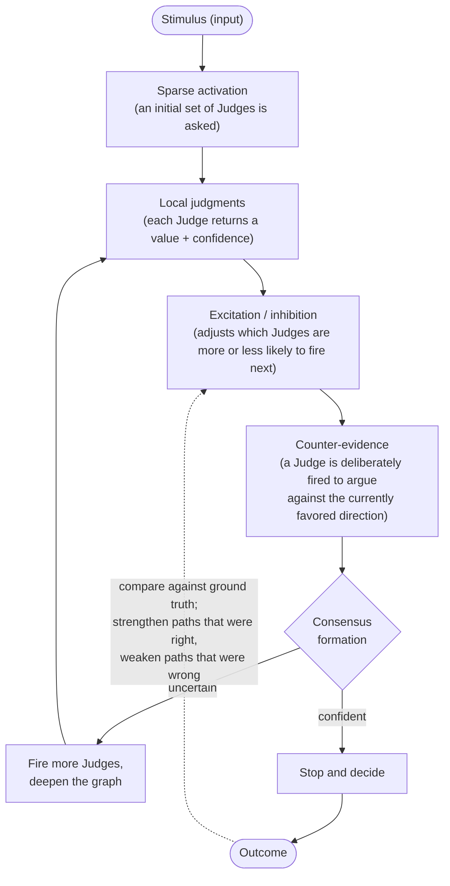
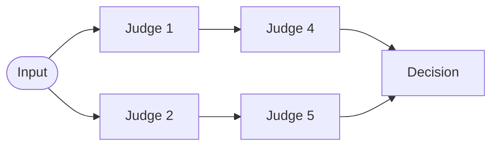

# Dynamic Judge Network

[](https://royhermit.github.io/dynamic-judge-network/)
[](LICENSE)
[](https://www.python.org/)

**Dynamic Judge Network (DJN)** is a research architecture for a
question this project treats as still open: can a decision be reached by
activating only the small subset of specialized evaluators a given
problem requires, rather than either running one large model or running
every evaluator every time?

Research framing: **Bio-inspired Dynamic Sparse Multi-Judge Reasoning.**

Everything below states clearly what is a *hypothesis to be tested* versus
what is *already implemented and measured* — see "Status" and "Results"
at the end for the current, honest line between the two.

## Interactive showcase

[**Launch the interactive showcase**](https://royhermit.github.io/dynamic-judge-network/)
([`index.html`](index.html), in Japanese) is a self-contained browser
demo of the *intuition* behind dynamic routing: a confidence score is
compared against an adaptive threshold θ to decide between an early exit
and a deeper path, and the simulator lets you vary ambiguity, urgency,
and an energy constraint to see the route change. It also compares that
idea against a static dense model and a standard MoE.

It is an explanatory illustration, not this project's implementation or
a result: it frames routing as a single network exiting early at a
confidence threshold, whereas the architecture below routes across
separate Judges and is not built on PyTorch. The pseudo-code shown in the
demo is illustrative only, and nothing in it has been measured on this
project's data (see "Status" and "Results").

## The problem

A single large language model can answer almost anything, but most real
decision problems are not "answer almost anything" problems — they are
narrow, binary-ish judgments: normal or anomalous, HIGH or LOW, act or
skip, supports a hypothesis or contradicts it. This project's premise —
itself part of what the experiments below are meant to test, not an
established fact — is that solving a narrow judgment with a model built
for open-ended generation plausibly spends more compute than the
judgment needs.

The alternative explored here is to decompose a decision into many
**Judges** — lightweight, narrow evaluators, each holding one point of
view on the same input — and combine their (possibly conflicting)
opinions into a final decision. This project's first Judge *backend* is
**Jev**, TypeSafe AI's non-generative "System One" model (see
"Architecture" for the executor that talks to it), but the architecture
is explicitly not Jev-specific: a Judge may equally be a small LLM, a
classifier, a rule engine, or a numerical model.

## Central hypothesis

> Activating only the Judges a given input needs, and combining their
> disagreement rather than averaging it away, can match or approach the
> accuracy of a large ensemble while *using* a fraction of its Judges and
> latency — and the network's routing itself can improve with
> experience. ("Using" here means activated/used, not merely fetched —
> see "The target reasoning loop" for why that distinction matters, since
> speculative fan-out can fetch a Judge's answer without it ending up
> used.)

This is a hypothesis to be measured, not a design assumed to work. The
project's guiding rule is **architecture follows evidence**: every
mechanism below gets added one at a time, against a baseline, so a
measured gain (or its absence) can be attributed to the specific
mechanism that produced it — never to several changes at once. Nothing
in this README describing a mechanism the project has not built yet
(see "Status") should be read as a result; it is the plan the "Results"
section will eventually be filled in against.

## The target reasoning loop

This is the shape the finished network is meant to have — most of it is
not built yet (see Status), but understanding the target loop is what
makes the individual mechanisms below cohere, rather than read as an
unrelated list:



Two distinctions this loop depends on, both already reflected in the
storage schema even though nothing writes to the relevant columns yet
(see Architecture):

- **Fetched vs. used.** Because of Jev's speculative fan-out (below), a
  Judge's question can be *asked* in the same batch as everything else
  even before the network has decided the Judge is "activated" — the
  routing logic decides afterward whether to *use* that answer or discard
  it. A fetched-but-discarded Judge still incurred a cost; an activated
  Judge is one whose answer was used. Reported Judge counts should
  specify which of these they mean.
- **Depth vs. breadth.** Judges with no dependency on each other can be
  batched into one stage and answered in parallel; latency is expected
  to track the number of *sequential* stages far more than it tracks
  total Judge count — a network that fires many Judges across few
  stages would, in principle, be expected to run faster than one that
  fires fewer Judges across many stages. This is one of the hypotheses
  Experiment 1 onward exists to check, not something already observed
  on this project's own data.

## Distinction from a fixed ensemble

A fixed ensemble runs the same set of models on every input:


That is not a strawman — a diverse fixed ensemble with per-role Judges
and weighted aggregation is one of this project's own required
baselines. The distinction a Dynamic Judge Network is testing for is not
diversity or weighting (a good fixed ensemble can have both); it is
**fixed execution versus input-dependent execution**: in DJN, which
Judges run next is itself a function of what earlier Judges concluded on
*this* input, not a fixed schedule run identically on every input:



Judge count is also a weak proxy for value on its own: ten Judges that
all ask "will this go up?" fail in a correlated way. The interesting
axis is **diversity of failure mode** — Judges that look at trend,
momentum, mean-reversion, volatility, or explicitly search for
counter-evidence against the currently favored direction — because a
Judge that is individually mediocre but wrong in a *different* way than
the rest can still improve the combined decision. Conceptually:

```
Utility(Judge) = Accuracy + UniqueContribution
                 - ErrorCorrelation - LatencyCost - ComputeCost
```

## Biological principles the design borrows

The project deliberately does not aim to reproduce a biological brain —
it borrows a short list of *mechanisms* from how biological systems
allocate limited attention, not the substrate:

| Principle | What it means here | Built? |
|---|---|---|
| **Sparse activation** | Most Judges stay silent on most inputs; which ones fire depends on the input. | No — foundation only runs whatever fixed Judge list it is given. |
| **Excitation** | A strong signal from one Judge makes a related Judge more likely to fire next. | No |
| **Inhibition** | A strong signal from one Judge can suppress an entire line of reasoning. | No |
| **Counter-evidence** | Once a decision leans one way, a Judge is deliberately fired to argue against it, so the network does not merely accumulate agreement. | No |
| **Early stopping** | Once confidence is high enough, no further Judges run; low agreement instead triggers *more* evidence-gathering. | No |
| **Plasticity** | Paths that historically led to correct decisions should be strengthened; paths that led to failures should be weakened. | No |

## The initial benchmark

The first task this project evaluates against is a **High/Low directional
prediction** problem, output as `HIGH`, `LOW`, or `SKIP`. This is not the
project's intended end use — it is a deliberately convenient first
benchmark: its output is discrete, ground truth can be generated
automatically (no human labeling bottleneck), and it supports continuous,
low-cost evaluation over time. Declining to answer (`SKIP`) is treated as
a first-class, valuable output, not a failure mode — a system that
recognizes when it *should not* decide is doing something a purely
accuracy-maximizing system cannot.

A **semantic router** that would first classify an arbitrary input into a
task type is deliberately excluded at this stage. Introducing it now
would make a failure ambiguous between task classification, Judge design,
Judge selection, graph activation, and aggregation — the single-task
setup keeps those causes separable while the core Judge-network
hypothesis is being tested.

## Research methodology

New mechanisms are added to the network one at a time, each measured
against the version before it, following a fixed experiment sequence
(fixed Judges → diverse roles → dynamic activation → excitation →
inhibition → counter-evidence → early stopping → learned weights →
memory/plasticity). This project's planned **baseline-first** discipline
means an experimental mechanism will always be compared against a single
Judge, a fixed parallel ensemble, and a diverse fixed ensemble, plus a
frontier LLM as a reference point (not a bar the early stages are trying
to clear) — none of that comparison harness is built yet (see Status);
it is what the experiment-runner spec will implement.

Results will be read as an **accuracy–coverage curve** rather than a
single accuracy number: raising the confidence threshold for a decision
should raise accuracy on the answered subset while lowering coverage
(the fraction of inputs the network was willing to answer at all), and
the shape of that trade-off is the thing under study. Latency, Judge
executions, and cost are planned as first-class metrics alongside
accuracy: the target is progress on the accuracy/latency/cost/coverage
Pareto frontier, not accuracy in isolation.

## Architecture (what exists today)

A `Judge` is a pure, side-effect-free contract:

```python
class Judge(Protocol):
    judge_id: str
    judge_version: str
    judge_prompt_or_definition: str

    def to_question(self, state: State) -> Question: ...
    def interpret(self, answer: Answer) -> Decision: ...
```

A Judge never calls a provider API itself — it only declares a typed
`Question` (Choice / Score / Noul) and later interprets a typed `Answer`
into a `Decision`. Fulfilling that question — via Jev, a small LLM, or
anything else — is entirely a `JudgeExecutor`'s concern, which is what
keeps the promise that **Jev is replaceable** literally true: nothing
above the executor layer ever imports a Jev-specific type. No concrete
Judges exist yet under `src/judges/definitions/` — only the contract and
the Jev executor below are implemented so far.

The one executor implemented so far, `JevStageExecutor`, exploits a
finding from this project's own research into Jev's API: it accepts many
independent typed questions against one shared state in a single
request, reading the state once and scoring every question against that
same representation. TypeSafe's own published cookbook example reports
roughly an order of magnitude lower cost and latency for 13 batched
questions versus 13 sequential calls — but that benchmark used a large
shared document against sequential single-question calls, and this
project's own states and concurrency profile are smaller, so whether the
same ratio holds here is precisely what Experiment 1 onward must measure
directly, not assume. Judges with no dependency between
them (the same graph stage, once a graph exists) are batched into one
provider call by this executor.

Every provider call — successful or failed — is durably recorded (via a
`StorageWriter` over `sqlite3`) the instant the provider responds,
strictly *before* any Judge's `interpret()` runs, so a bug in one Judge's
interpretation can never cause an already-incurred cost to go
unrecorded. The schema has five tables (`experiments`, `inputs`, `calls`,
`judge_logs`, `decisions`); today only `calls` and `judge_logs` are
written by the executor and writer — `experiments`, `inputs`, and
`decisions` exist so a future experiment runner does not require a
breaking migration, but nothing in the foundation layer writes them yet,
so a full experimental run cannot yet be reconstructed end-to-end from
this database alone.

## Setup

Requires Python 3.11+.

```bash
python3 -m venv venv
venv/bin/pip install -r requirements.txt
cp .env.example .env
# edit .env and set TYPESAFE_API_KEY
```

Run the tests:

```bash
venv/bin/pytest
```

## Status

Foundation stage only. Built: the Judge/executor/storage contract,
`JevStageExecutor`, and `sqlite3` storage for provider calls and raw/
interpreted Judge output. Not yet built — still stub `README.md` files
under `src/` — everything that makes the network *dynamic*: the
activation graph, excitation/inhibition, early stopping, the aggregator,
the experiment runner and its baselines, the benchmark data pipeline, and
the metrics/diversity layer. Concretely, no concrete Judge (Trend,
Momentum, etc.) has been implemented yet either.

## Results

Not yet available — no experiment has been run end-to-end. This section
will fill in incrementally as the Ablation Test sequence progresses:

- **After Experiment 1** (fixed Judges + average — Baseline A single
  Judge, Baseline B fixed parallel ensemble, Baseline C diverse fixed
  ensemble): an accuracy–coverage table/curve at several confidence
  thresholds, and latency/attempted-vs-answered-Judge-count comparisons
  across those three baselines. No *dynamic* activation exists yet at
  this stage, so there is no Dynamic Judge Network configuration to
  compare against — this experiment establishes the baseline numbers
  everything after it is measured against.
- **From Experiment 3 onward** (once dynamic activation exists): the
  same accuracy–coverage/latency/cost comparison repeated with a Dynamic
  Judge Network configuration included, reporting attempted, answered
  (fetched a Jev response), and used (actually informed the decision)
  Judge counts separately — see "The target reasoning loop" above for
  why those three numbers can differ.
- Whatever cost/latency ratio Jev's speculative fan-out is found to
  produce on this project's own data (see Architecture above).

This section is a placeholder by design — it exists now so that future
results land in the README directly rather than in a separate document
someone has to go looking for.

## Related work

This project's framing overlaps with, but is distinct from, several
current research directions — these are partial inspirations for the
thinking above, not claims that DJN directly implements or replicates
any of them:

- **Collective intelligence over single-model scale.** Sakana AI's
  public research argues that combining many smaller, specialized
  models/agents — their `Fugu` multi-agent orchestration system and
  `AB-MCTS` ("Inference-Time Scaling and Collective Intelligence for
  Frontier AI") — can match or exceed a single frontier model, a
  swarm/colony framing close in spirit to this project's Judge
  decomposition. The main divergence: DJN targets one fixed narrow
  decision task with sparse activation and early stopping, not
  open-ended agentic orchestration via exhaustive search.
- **Connectome-inspired neural architectures.** The 2023 full mapping of
  the fruit fly (*Drosophila*) brain connectome ("The connectome of an
  insect brain", *Science*) has driven a wave of work using that wiring
  diagram to constrain or directly instantiate neural models, including
  recent whole-brain-connectome-to-locomotion-control work. This project
  draws on the same underlying observation — a small, sparse, specialized
  biological circuit can produce competent behavior — without attempting
  to reproduce fly neural circuitry itself (see "Biological principles"
  above).
- **Allocating compute/state proportional to local need.** Meta's Byte
  Latent Transformer replaces fixed tokenization with dynamically-sized
  patches determined by local entropy, so compute is spent where
  complexity demands it rather than uniformly. The analogy this project
  draws is at the level of *philosophy*, not mechanism: a Judge should
  hold and process only what its narrow question requires, not a large
  fixed context — the specific technique (entropy-based byte patching)
  does not transfer to Judge design directly.

Sources: [Sakana Fugu](https://sakana.ai/fugu-beta/) ·
[AB-MCTS](https://sakana.ai/ab-mcts/) ·
[The connectome of an insect brain (Science)](https://www.science.org/doi/10.1126/science.add9330) ·
[Whole-Brain Connectomic Graph Model Enables Whole-Body Locomotion Control in Fruit Fly](https://arxiv.org/pdf/2602.17997) ·
[Byte Latent Transformer: Patches Scale Better Than Tokens](https://arxiv.org/abs/2412.09871)

## Further reading

- [`docs/context/dynamic-judge-network-context.md`](docs/context/dynamic-judge-network-context.md) — the full research context this README summarizes, including the complete research-question list, the per-experiment ablation table, and every required metric/log field.
- [`docs/superpowers/specs/`](docs/superpowers/specs/) — approved specs and design history.
