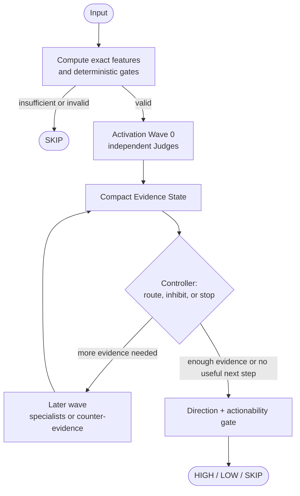
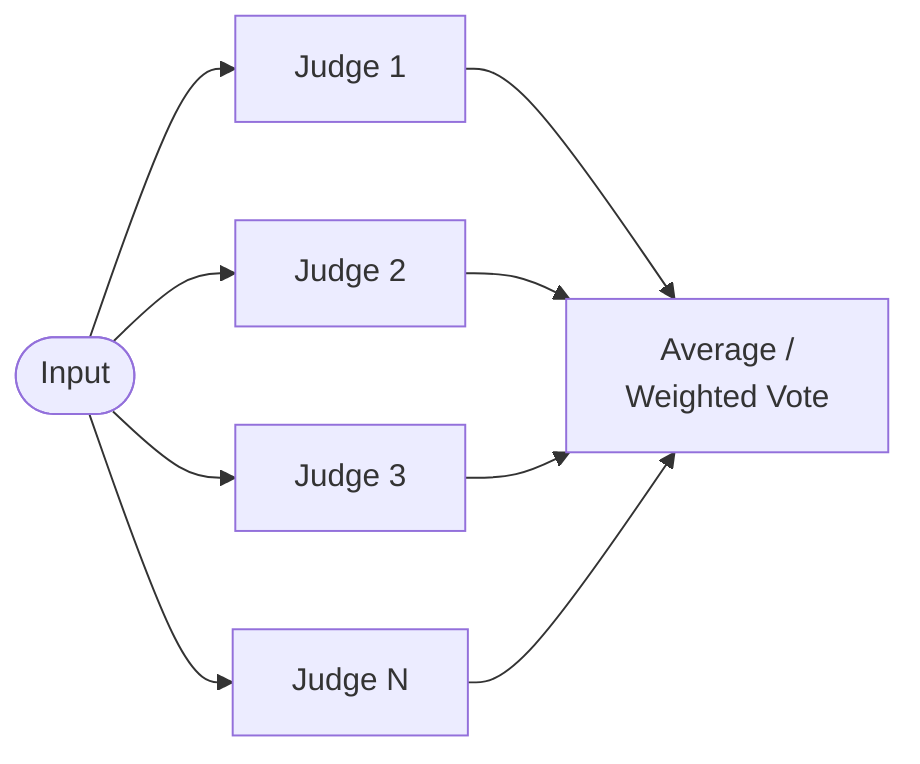

# Dynamic Judge Network

[](https://royhermit.github.io/dynamic-judge-network/)
[](LICENSE)
[](https://www.python.org/)

**Dynamic Judge Network (DJN)** is a research architecture for a
question this project treats as still open: can a decision be reached by
activating only the small subset of specialized evaluators a given
problem requires, rather than either running one large model or running
every evaluator every time?

Research framing: **Bio-inspired Dynamic Sparse Multi-Judge Reasoning.**

Everything below states clearly what is a *hypothesis to be tested* versus
what is *already implemented and measured* — see "Status" and "Results"
at the end for the current, honest line between the two.

## Interactive showcase

[**Launch the interactive showcase**](https://royhermit.github.io/dynamic-judge-network/)
([`index.html`](index.html)) is a standalone, dependency-free browser
explainer for the current DJN research direction. Its synthetic High/Low
scenario lets you change directional evidence, reversal risk, noise,
data completeness, wave budget, speculative fetching, and the Wave 1
routing rule. A fixed threshold is the default; an optional deterministic
adaptive-threshold preview illustrates one SpikingBrain-inspired research
hypothesis. It shows the
deterministic gate, Activation Waves, Evidence State, counter-evidence,
`HIGH`/`LOW`/`SKIP` outcome, and requested/fetched/activated/used counts.

The simulator uses hand-written teaching rules in
[`assets/simulator.mjs`](assets/simulator.mjs). It makes no Jev or market
data calls, and its scores and question counts are not measured accuracy,
latency, or cost results. The actual network controller and benchmark
pipeline are still future work (see "Status" and "Results").

The published `index.html` embeds its styles and script, so a downloaded
copy works when opened directly in a browser. When editing the source files
under `assets/`, regenerate and check that standalone file with:

```bash
node scripts/build-showcase.mjs
node scripts/build-showcase.mjs --check
```

## The problem

A single large language model can answer almost anything, but most real
decision problems are not "answer almost anything" problems — they are
narrow, binary-ish judgments: normal or anomalous, HIGH or LOW, act or
skip, supports a hypothesis or contradicts it. This project's premise —
itself part of what the experiments below are meant to test, not an
established fact — is that solving a narrow judgment with a model built
for open-ended generation plausibly spends more compute than the
judgment needs.

The alternative explored here is to decompose a decision into many
**Judges** — lightweight, narrow evaluators, each holding one point of
view on the same input — and combine their (possibly conflicting)
opinions into a final decision. This project's first Judge *backend* is
**Jev**, TypeSafe AI's non-generative "System One" model (see
"Architecture" for the executor that talks to it), but the architecture
is explicitly not Jev-specific: a Judge may equally be a small LLM, a
classifier, a rule engine, or a numerical model.

## Central hypothesis

> Can diverse lightweight Judges, deterministic gates, compact
> intermediate evidence, and input-dependent Activation Waves decide
> *which* judgment is useful next and *when* to stop, improving the
> accuracy–latency–cost–coverage trade-off over a single Judge or a
> fixed multi-Judge ensemble?

This is a hypothesis to be measured, not a design assumed to work. The
project's guiding rule is **architecture follows evidence**: every
mechanism below gets added one at a time, against a baseline, so a
measured gain (or its absence) can be attributed to the specific
mechanism that produced it — never to several changes at once. Nothing
in this README describing a mechanism the project has not built yet
(see "Status") should be read as a result; it is the plan the "Results"
section will eventually be filled in against.

The novelty being tested is the *dynamic composition of a reasoning
path*. Jev-as-a-Judge, typed decisions, confidence escalation,
shared-state batching, and deterministic filters are useful prior
patterns, not novelty claims. The [research direction update](docs/context/djn-research-direction-update.md)
sets out that boundary and the refined experimental requirements.

## The target reasoning loop

This is the shape the finished network is meant to have — most of it is
not built yet (see Status), but understanding the target loop is what
makes the individual mechanisms below cohere, rather than read as an
unrelated list:



Three distinctions matter when testing this loop:

- **Attempted, fetched, activated, and used.** An attempted question may
  fail before returning an answer. A fetched Judge returned an answer
  and incurred provider work; an activated Judge was placed on the
  controller's reasoning path; a used Judge materially affected routing,
  aggregation, or the final decision. These sets can differ when
  questions are batched speculatively. The foundation database records
  attempts and fetched answers and has a nullable `was_used` field;
  activation and use decisions are not written yet (see Architecture).
- **Depth vs. breadth.** Judges with no dependency on each other can be
  batched into an Activation Wave. When they share state, a backend may
  answer the wave in one request. This is an executor optimization, not
  part of the abstract Judge API. Wave count and graph depth must be
  measured separately from Judge count and provider request count.
- **Direction vs. actionability.** Choosing `HIGH` over `LOW` does not
  establish that either is safe to act on. Missing data, weak evidence,
  disagreement, or a low actionability score can lead to `SKIP`; missing
  evidence must never silently mean safe or false.

## Distinction from a fixed ensemble

A fixed ensemble runs the same set of models on every input:



That is not a strawman — a diverse fixed ensemble with per-role Judges
and weighted aggregation is one of this project's own required
baselines. The distinction a Dynamic Judge Network is testing for is not
diversity or weighting (a good fixed ensemble can have both); it is
**fixed execution versus input-dependent execution**: in DJN, which
Judges run next is itself a function of what earlier Judges concluded on
*this* input, not a fixed schedule run identically on every input:


Judge count is also a weak proxy for value on its own: ten Judges that
all ask "will this go up?" fail in a correlated way. The interesting
axis is **diversity of failure mode** — Judges that look at trend,
momentum, mean-reversion, volatility, or explicitly search for
counter-evidence against the currently favored direction — because a
Judge that is individually mediocre but wrong in a *different* way than
the rest can still improve the combined decision. Conceptually:

```
Utility(Judge) = Accuracy + UniqueContribution
                 - ErrorCorrelation - LatencyCost - ComputeCost
```

## Biological principles the design borrows

The project deliberately does not aim to reproduce a biological brain —
it borrows a short list of *mechanisms* from how biological systems
allocate limited attention, not the substrate:

| Principle | What it means here | Built? |
|---|---|---|
| **Sparse activation** | Most Judges stay silent on most inputs; which ones fire depends on the input. | No — foundation only runs whatever fixed Judge list it is given. |
| **Excitation** | A strong signal from one Judge makes a related Judge more likely to fire next. | No |
| **Inhibition** | A strong signal from one Judge can suppress an entire line of reasoning. | No |
| **Counter-evidence** | Once a decision leans one way, a Judge is deliberately fired to argue against it, so the network does not merely accumulate agreement. | No |
| **Early stopping** | Once confidence is high enough, no further Judges run; low agreement instead triggers *more* evidence-gathering. | No |
| **Plasticity** | Paths that historically led to correct decisions should be strengthened; paths that led to failures should be weakened. | No |

## The initial benchmark

The first task this project evaluates against is a **High/Low directional
prediction** problem, output as `HIGH`, `LOW`, or `SKIP`. This is not the
project's intended end use — it is a deliberately convenient first
benchmark: its output is discrete, ground truth can be generated
automatically (no human labeling bottleneck), and it supports continuous,
low-cost evaluation over time. Declining to answer (`SKIP`) is treated as
a first-class, valuable output, not a failure mode — a system that
recognizes when it *should not* decide is doing something a purely
accuracy-maximizing system cannot.

A **semantic router** that would first classify an arbitrary input into a
task type is deliberately excluded at this stage. Introducing it now
would make a failure ambiguous between task classification, Judge design,
Judge selection, graph activation, and aggregation — the single-task
setup keeps those causes separable while the core Judge-network
hypothesis is being tested.

## Research methodology

New mechanisms are added one at a time and measured against the preceding
configuration. The planned progression starts with fixed execution and
diverse fixed roles, then deterministic dynamic activation, Activation
Waves, counter-evidence, inhibition, early stopping, Evidence State
compression, deterministic pre-gates, and speculative batching. Learned
routing and path memory follow only if measurements justify them. The
initial High/Low benchmark remains one task; a general semantic router
is future work.

The refined comparators are **A** single Judge, **B** single Judge with
confidence escalation, **C** fixed multi-Judge, **D** diverse fixed
multi-Judge, **E** Dynamic Judge Network, and **F** frontier LLM reference.
The last is a quality/cost/latency reference, not an early accuracy target.
Experiment 1 still starts with fixed Judges and simple averaging; later
specs will assign each additional comparison and mechanism to a discrete
ablation. None of the comparison harness is built yet (see Status).

The [SpikingBrain-inspired research input](docs/context/djn-research-input-spikingbrain.md)
adds candidate later studies of fixed versus adaptive Judge thresholds,
flat versus group routing, and bounded extra waves for difficult inputs.
They do not change Experiment 1. Judge execution sparsity must be read
with accuracy, coverage, latency, provider calls, and cost; fetching a
speculative answer still incurs work even if the Judge is not activated.

Results will be read as an **accuracy–coverage curve** rather than a
single accuracy number: raising the confidence threshold for a decision
should raise accuracy on the answered subset while lowering coverage
(the fraction of inputs the network was willing to answer at all), and
the shape of that trade-off is the thing under study. Latency, Judge
executions, and cost are planned as first-class metrics alongside
accuracy: the target is progress on the accuracy/latency/cost/coverage
Pareto frontier, not accuracy in isolation.

## Architecture (what exists today)

A `Judge` is a pure, side-effect-free contract:

```python
class Judge(Protocol):
    judge_id: str
    judge_version: str
    judge_prompt_or_definition: str

    def to_question(self, state: State) -> Question: ...
    def interpret(self, answer: Answer) -> Decision: ...
```

A Judge never calls a provider API itself — it only declares a typed
`Question` (Choice / Score / Noul) and later interprets a typed `Answer`
into a `Decision`. Fulfilling that question — via Jev, a small LLM, or
anything else — is entirely a `JudgeExecutor`'s concern, which is what
keeps the promise that **Jev is replaceable** literally true: nothing
above the executor layer ever imports a Jev-specific type. No concrete
Judges exist yet under `src/judges/definitions/` — only the contract and
the Jev executor below are implemented so far.

The one executor implemented so far, `JevStageExecutor`, exploits a
finding from this project's own research into Jev's API: it accepts many
independent typed questions against one shared state in a single
request, reading the state once and scoring every question against that
same representation. TypeSafe's own published cookbook example reports
roughly an order of magnitude lower cost and latency for 13 batched
questions versus 13 sequential calls — but that benchmark used a large
shared document against sequential single-question calls, and this
project's own states and concurrency profile are smaller, so whether the
same ratio holds here is precisely what Experiment 1 onward must measure
directly, not assume. Judges with no dependency between
them (the same graph stage, once a graph exists) are batched into one
provider call by this executor.

Every provider call — successful or failed — is durably recorded (via a
`StorageWriter` over `sqlite3`) the instant the provider responds,
strictly *before* any Judge's `interpret()` runs, so a bug in one Judge's
interpretation can never cause an already-incurred cost to go
unrecorded. The schema has five tables (`experiments`, `inputs`, `calls`,
`judge_logs`, `decisions`); today only `calls` and `judge_logs` are
written by the executor and writer — `experiments`, `inputs`, and
`decisions` exist so a future experiment runner does not require a
breaking migration, but nothing in the foundation layer writes them yet,
so a full experimental run cannot yet be reconstructed end-to-end from
this database alone.

## Setup

Requires Python 3.11+.

```bash
python3 -m venv venv
venv/bin/pip install -r requirements.txt
cp .env.example .env
# edit .env and set TYPESAFE_API_KEY
```

Run the tests:

```bash
venv/bin/pytest
```

The standalone browser simulator can also be checked with Node.js (no
packages to install):

```bash
node tests/showcase.test.mjs
node tests/showcase-standalone.test.mjs
```

## Status

Foundation stage only. Built: the Judge/executor/storage contract,
`JevStageExecutor`, and `sqlite3` storage for provider calls and raw/
interpreted Judge output. Not yet built — still stub `README.md` files
under `src/` — everything that makes the network *dynamic*: the
activation graph, Activation Waves, Evidence State, deterministic
pre-gates, excitation/inhibition, early stopping, the aggregator, the
experiment runner and its baselines, the benchmark data pipeline, and
the metrics/diversity layer. Concretely, no concrete Judge (Trend,
Momentum, etc.) has been implemented yet either.

## Results

Not yet available — no experiment has been run end-to-end. This section
will fill in incrementally as the Ablation Test sequence progresses:

- **After Experiment 1** (fixed Judges + average): an accuracy–coverage
  table/curve at several decision thresholds, calibration, `SKIP` rate,
  latency, attempted question count, fetched answer count, request count,
  and questions per request for the fixed configurations specified by
  that experiment.
  There is no dynamic activation at this stage.
- **In later baseline studies:** compare the single-Judge confidence
  escalation cascade (B) and diverse fixed roles (D) against single
  Judge (A) and fixed multi-Judge (C) under the same data and evaluation
  protocol. Their exact experiment boundaries belong in future specs.
- **Once dynamic activation exists:** repeat the quality, coverage,
  latency, and cost comparison with configuration E. Report attempted,
  fetched, activated, and used Judge counts separately, along with wave
  count, graph depth, and stop reasons. Test full raw state against
  compact Evidence State as its own ablation.
- Whatever cost/latency ratio Jev's speculative fan-out is found to
  produce on this project's own data (see Architecture above).

This section is a placeholder by design — it exists now so that future
results land in the README directly rather than in a separate document
someone has to go looking for.

## Related work

This project's framing overlaps with, but is distinct from, several
current research directions — these are partial inspirations for the
thinking above, not claims that DJN directly implements or replicates
any of them:

- **Collective intelligence over single-model scale.** Sakana AI's
  public research argues that combining many smaller, specialized
  models/agents — their `Fugu` multi-agent orchestration system and
  `AB-MCTS` ("Inference-Time Scaling and Collective Intelligence for
  Frontier AI") — can match or exceed a single frontier model, a
  swarm/colony framing close in spirit to this project's Judge
  decomposition. The main divergence: DJN targets one fixed narrow
  decision task with sparse activation and early stopping, not
  open-ended agentic orchestration via exhaustive search.
- **Connectome-inspired neural architectures.** The 2023 full mapping of
  the fruit fly (*Drosophila*) brain connectome ("The connectome of an
  insect brain", *Science*) has driven a wave of work using that wiring
  diagram to constrain or directly instantiate neural models, including
  recent whole-brain-connectome-to-locomotion-control work. This project
  draws on the same underlying observation — a small, sparse, specialized
  biological circuit can produce competent behavior — without attempting
  to reproduce fly neural circuitry itself (see "Biological principles"
  above).
- **Allocating compute/state proportional to local need.** Meta's Byte
  Latent Transformer replaces fixed tokenization with dynamically-sized
  patches determined by local entropy, so compute is spent where
  complexity demands it rather than uniformly. The analogy this project
  draws is at the level of *philosophy*, not mechanism: a Judge should
  hold and process only what its narrow question requires, not a large
  fixed context — the specific technique (entropy-based byte patching)
  does not transfer to Judge design directly.
- **Event-driven sparse model computation.** SpikingBrain reports
  adaptive-threshold spiking and sparse activity *inside* a neural model.
  DJN's separate hypothesis is that Evidence State could regulate which
  heterogeneous Judges run next, including counter-evidence and bounded
  bursts for difficult inputs. Its model-level sparsity and efficiency
  figures are not DJN results, and DJN does not propose an SNN.

Sources: [Sakana Fugu](https://sakana.ai/fugu-beta/) ·
[AB-MCTS](https://sakana.ai/ab-mcts/) ·
[The connectome of an insect brain (Science)](https://www.science.org/doi/10.1126/science.add9330) ·
[Whole-Brain Connectomic Graph Model Enables Whole-Body Locomotion Control in Fruit Fly](https://arxiv.org/pdf/2602.17997) ·
[Byte Latent Transformer: Patches Scale Better Than Tokens](https://arxiv.org/abs/2412.09871) ·
[SpikingBrain: Spiking Brain-inspired Large Models, v4](https://arxiv.org/abs/2509.05276v4)

## Further reading

- [`docs/context/dynamic-judge-network-context.md`](docs/context/dynamic-judge-network-context.md) — the research context and question list, with revised baseline labels and ablation progression.
- [`docs/context/djn-research-direction-update.md`](docs/context/djn-research-direction-update.md) — the current research refinement, novelty boundary, baseline taxonomy, and proposed future logging requirements.
- [`docs/context/djn-research-input-spikingbrain.md`](docs/context/djn-research-input-spikingbrain.md) — source-bounded SpikingBrain inspiration and candidate adaptive-threshold, hierarchy, sparsity, and burst ablations.
- [`docs/superpowers/specs/`](docs/superpowers/specs/) — approved specs and design history.
